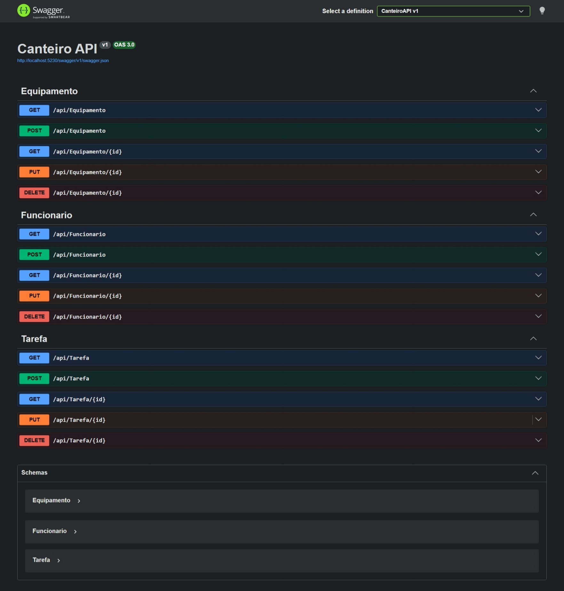

# Canteiro API

Olá, meu nome é Kaik Novais e esta é uma API de teste desenvolvida com .NET Core para gerenciamento de obras, permitindo o controle de funcionários, equipamentos e tarefas.

## Tecnologias


## Entidades

- **Funcionario** — cadastro de profissionais da obra
- **Equipamento** — controle de máquinas e ferramentas
- **Tarefa** — atribuição de atividades a funcionários e equipamentos

## Como rodar

1. Clone o repositório
2. Entre na pasta do projeto
3. Rode os comandos:

```bash
dotnet restore
dotnet ef database update
dotnet run
```

4. Acesse o Swagger em `http://localhost:{porta}/swagger`

## Documentação

A documentação interativa da API está disponível via Swagger e permite visualizar e testar todos os endpoints diretamente pelo browser.

